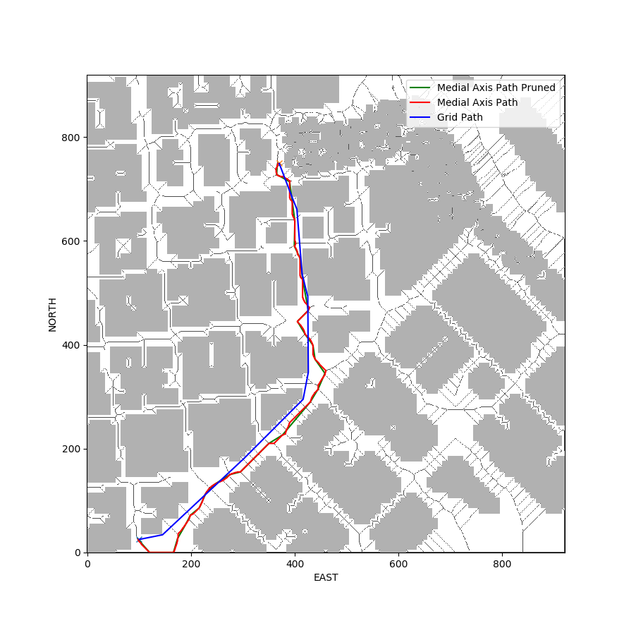

## Project: 3D Motion Planning
In this project the backward_flyer is extended to find an optimal path to an arbitary location in a given map. 

# Steps taken to complete the Project:
1. 2.5D map is loaded from the colliders.csv file describing the environment.
2. The environment is discretized into grid and graphs.
3. The current location of quadcopter is set a starting point and an arbitary point in the map is chosen as goal.
4. A* algorithm is used to perform the search an optimal path.
5. A combination of collinearity test and bresenham algorithm is used to remove unwanted points in the identified path.
6. Waypoints are calculated in the local ECEF coordinates from the 2D path found using A*(format for `self.all_waypoints` is [N, E, altitude, heading]).

## [Rubric](https://review.udacity.com/#!/rubrics/1534/view) Points
### All the rubic points are considered in the project and it is discussed here how each rubic point is implemented.
---
### Writeup / README

#### 1. Provide a Writeup / README that includes all the rubric points and how you addressed each one.  You can submit your writeup as markdown or pdf.  

Project report is done.

### Explain the Starter Code

#### 1. Explain the functionality of what's provided in `motion_planning.py` and `planning_utils.py`

The motion planning project is an extension of backyard flying project. Both the project use the event driven programming paradigm. The major difference between *'backyard_flyer_solution.py'* and *'motion_planning.py'* is that in *'motion_planning.py'* there is an additional state called **PLANNING** where the drone path is calculated using A* algirithm. Whereas in *'backyard_flyer_solution.py'* the waypoints are hard coded.

The starter code of the motion planning project contains some utility funcitons in the *'planning_utils.py'* and there some more funcitons are added, which are used in the path planning algorithm. The following table shows the list functions and their description in the *'planning_utils.py'* 

Name in the function | Description|
|:-|:-|
create_grid| This function creats a 2D grid of the environment based on the data from the **'colliders.csv'** file. This function takes into account the drone altitude and the safe distance that the drone can fly near an obstacles when creating the grid.
Action(enum)| This enum defines the possible movements of the drone which can be used by the path planning algorithm. The following direction are defined in the enum North,East,South,West,North-East,North-West,South-East,South-East,South-West.
valid_actions| This functions checks if all the drone actions(movements) are possible without hitting obstacles for a given location in the grid. 
a_star| This function implements the A* algorithm it calculates the optimal path for a given start and goal location in the grid using the defined drone actions and heuristic function.
heuristic| This function defines the heuristic i.e. it calculates an a cost between the current position and the goal without considering the grid. In this project 2nd order vector norm is used as heuristic
collinearity_check| This function takes in three points and checks if the three points lie in straight line by calculating the area of triangle formed by the three points. This function takes in epislon as parameter which is compared with the area and decided if the points lie in a straight line.
bresenham_collision_check| Given two points and grid this function checks if the line drawn between two points collide any obstacles in the grid
prune_path_bresenham|For a given path and grid this function returns a pruned path by removing unneccasary points. This funciton works based on bresenham_collision_check.
prune_path| For a given path and grid this function returns a pruned path by removing unneccasary points. This funciton works based on collinearity_check and bresenham_collision_check.
find_start_goal| This function calculates the nearest starting and goal points in a graph for a given starting and goal points in the grid.
find_waypoints| For a given 2D path this function calculates the heading angle of the drone in radians and returns the 3D waypoint along with the heading

### Implementing Your Path Planning Algorithm

#### 1. Set your global home position
The function *plan_path()* in the *MotionPlanning* class reads the *lat0* and *lon0* from the **colliders.csv** file and sets the global home poisiton of the drone at [lat0,lon0,0] using the function self.set_home_position(). The global location [lat0,lon0,0] given in the **colliders.csv** files corresponds to the map center in the given grid. Whereas in the grid (0,0)/home position corresponds to the south-west corner of the grid. And for this reason the north offset and east offset are required to convert from the coordinate system used by the drone and the coordinate system used in the grid. The north and east offset are the coordinates of the south-west corner in the map center coordinates. This is returned by create_grid function. The offset correction could be avoided if the global_home of drone is set to the south-west corner of the grid but there is a bug in the self.set_global_home() function and it does not work as expected.

#### 2. Set your current local position
The local position of the drone can be calculated in two different ways either by using the function self.local_position or by converting the global coordinates to local coordinates using the function global_to_local. Here the global location of the drone is calculated using self._latitude,self._longitude and self._altitude functions and the global position is converted to local position using the global_to_local().

#### 3. Set grid start position from local position
The grid start position is set to the local position calculated in the last step. This is done so that the drone can start from any point in the grid rather than the map center always. 

#### 4. Set grid goal position from geodetic coords
The program is implemented such a way that the goal position can be set either in the local ECEF coordinates or the geodatic global coordinate system. This can be switched using the parameter *goal_set_latlon* inside the *path_plan()* if the value is true then the goal is set using global coordinates and if it false local coordinates is used to set the goal. When global coordinates is used to set the goal it is converted to local coordinates and given to the A* algorithm.

#### 5. A* Implementation

The starter code provides a simple A* implementation in 2D using the drone motion in the direction North,East,South and West direction. In this A* implementation two main features are added. First the diagonal movements of the drone are included in the Actions and used by the A* algorithm and the second point is the use of Medial-Axis based skeleton representation instead of the default grid. After several trials with different maps such as standard grid, voronoi graph, probablistic road map and medial axis skeleton it was found that medial axis skeleton representation perfomes in a optimal way. Medial axis reperesentation takes very less time to build the graph and find path like standard 2D grid and provides a safe path to the drone comparable to voronoi graph. In terms of drone safety voronoi graph representation performs very similar to medial axis but it takes longer time to build teh graph. Whereas probablistic road map provides a better graph making use of 3D space but it takes even longer time.

Medial axis skeleton representation creates a skeleton between different obstacles and using this skeleton for A* search creates a safe path in the middle of obstacles. Using 2D grid representation the planned path is too close to the obstacles and this sometimes causes the drones to hit the obstacles. Only disadvantage of medial axis representation is that the plan if pruned using the medial-axis skeleton the plan has too many waypoints and if it is pruned using the grid the path is not along the medial axis anymore. In order to overcome this disadvantage the path pruning is done using a combination of bresenham tracing method and collinearity check which is discussed in the next section.

The picture below shows the comparision of medial axis representation against 2D grid and voronoi graph representation using a path plan between two arbitary points.

##### Grid vs Medial Axis

##### Voronoi Graph Representation

#### 6. Cull waypoints 
For this step you can use a collinearity test or ray tracing method like Bresenham. The idea is simply to prune your path of unnecessary waypoints. Explain the code you used to accomplish this step.

### Execute the flight
#### 1. Does it work?
It works!

